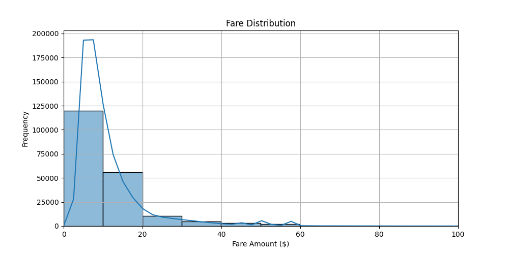
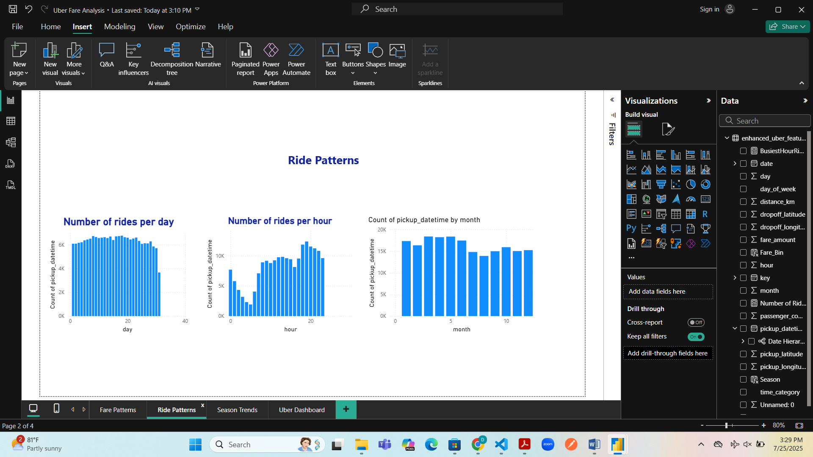
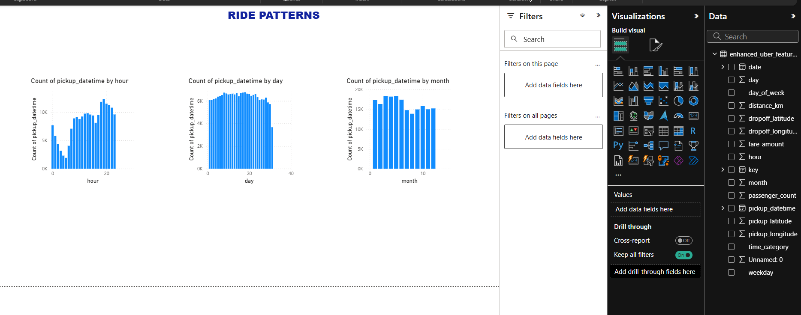
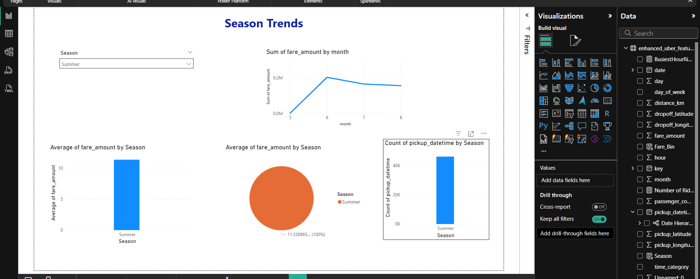
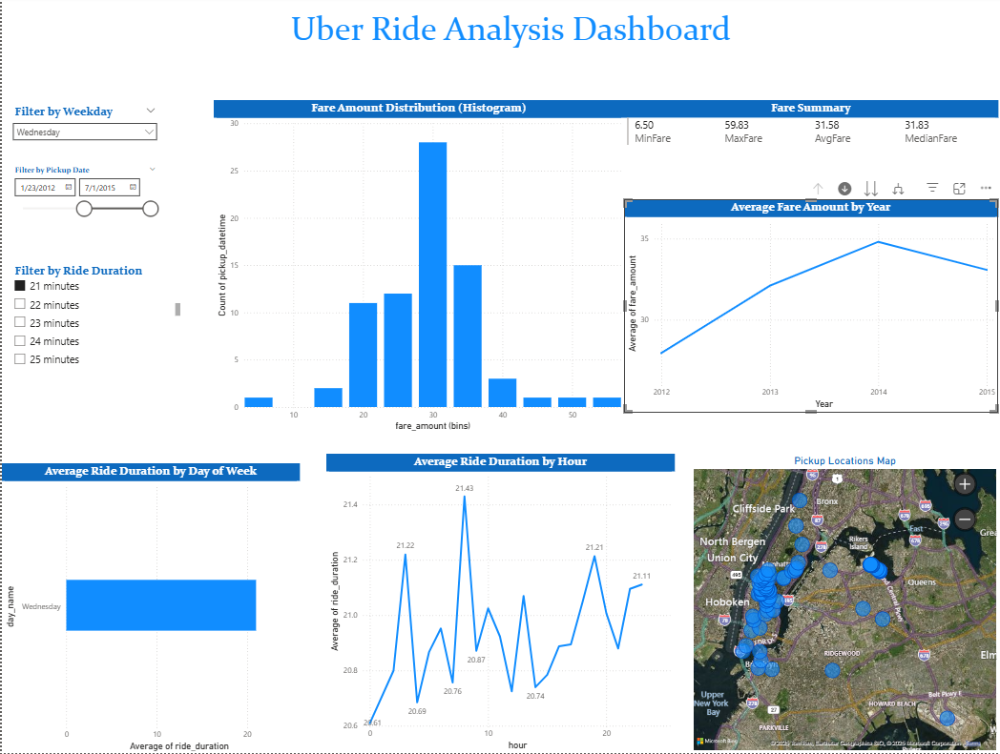

# Uber Fares Dataset Analysis – INSY 8413

**Name:** Uwamwezi Denyse
**ID:** 27976
**Course:** Introduction to Big Data Analytics  
**Instructor:** Eric Maniraguha  

## Table of Contents
- [Introduction](#introduction)
- [Methodology](#methodology)
- [EDA](#exploratory-data-analysis-eda)
- [Feature Engineering](#feature-engineering)
- [Analysis](#analysis)
- [Dashboard Development](#dashboard-development-stages)
- [Key Results](#results-key-discoveries-and-pattern-identification)
- [Conclusion](#conclusion-summary-of-main-findings--recommendations)

## Introduction

This project focuses on analyzing the Uber Fares Dataset, sourced from Kaggle, to gain comprehensive insights into fare patterns, ride durations, and key operational metrics. Using Python for data cleaning and exploratory analysis, and Power BI Desktop for interactive visualizations, the goal is to understand how fares vary by time, location, and other factors.

The objectives of this analysis are to:  
- Explore and clean the Uber Fares dataset to ensure quality data for analysis.  
- Identify patterns and trends in fare amounts and ride durations over different time periods.  
- Examine how factors such as time of day, day of week, and seasonality impact rides and fares.  
- Develop an interactive Power BI dashboard that presents these insights clearly and professionally.  
- Provide data-driven recommendations to optimize Uber’s operational efficiency and pricing strategies.

## Methodology

### Data Collection  
The Uber Fares Dataset was downloaded from [Kaggle](https://www.kaggle.com/datasets/yasserh/uber-fares-dataset). The dataset contains detailed information about Uber rides, including fare amounts, timestamps, distances, and locations.

###  Data Preparation and Cleaning

The raw dataset was initially loaded into Python using **Pandas**. The data underwent a comprehensive cleaning and preprocessing phase to ensure analytical integrity and reliability. This process focused on removing inconsistencies, standardizing formats, and enhancing temporal and spatial dimensions for further analysis.

#### Key Cleaning Steps:

- **Missing Values Handling**: Rows with missing values in critical fields such as `fare_amount`, `pickup_datetime`, and geolocation coordinates were dropped to maintain data completeness.
- **Invalid Fare Removal**: Entries with **negative or zero fare amounts** were excluded as they represent invalid transactions.
- **Outlier Treatment**: Extreme values in fare amounts were identified using **Interquartile Range (IQR)** and filtered out to reduce skewness.
- **Datetime Parsing**: The `pickup_datetime` field was converted to proper datetime format, with invalid timestamps removed.
- **Passenger Count Filtering**: Unrealistic values (like zero or unusually high passenger counts) were excluded to maintain logical consistency.
- **Duplicate Removal**: All duplicate rows were dropped to avoid overrepresentation in analysis.
**Export Cleaned Data:** The cleaned dataset was exported as a CSV file (`./data/cleaned_uber`) to enable smooth import into Power BI for further analysis.

## Exploratory Data Analysis (EDA)

Before building the Power BI dashboard, an in-depth exploratory data analysis was conducted in Python to uncover important patterns, distributions, and relationships within the dataset.

### Univariate Analysis  
- **Fare Amounts:** The distribution of fares is heavily right-skewed, with most rides priced below $20. Boxplots and histograms revealed several outliers representing unusually high fares.  
- **Passenger Count:** Most rides involved 1–2 passengers, consistent with typical ride-sharing usage.  
- **Datetime Trends:** Ride frequency peaks during morning and evening rush hours.

### Spatial Distribution  
- Pickup and drop-off locations cluster mainly around major urban areas, particularly Manhattan and JFK airport.  
- A heatmap of pickup locations highlighted demand hotspots within New York City.

### Temporal Patterns  
- **Hourly Trends:** There are clear peaks around 8 AM and 6 PM, reflecting commuter activity.  
- **Day of Week:** Fridays and Saturdays have higher ride volumes.  
- **Monthly and Seasonal Trends:** Some months show increased ride frequency, likely tied to tourism or weather.

### Bivariate Relationships  
- **Fare vs. Distance:** A strong positive correlation confirms that longer trips cost more.  
- **Fare vs. Time of Day:** Average fares tend to be slightly higher during late-night and early-morning hours.

> *These insights shaped the design of the Power BI dashboard and guided which visualizations to include to tell a compelling data story.*

 (./images/averageFair.png)

## Feature Engineering:

New columns were derived to enrich the dataset and support deeper insights:
- **Hour, Day, and Month**: Extracted from `pickup_datetime` for temporal trend analysis.
- **Day-of-Week**: Added to examine ride patterns across weekdays vs. weekends.
- **Time-of-Day Buckets**: Grouped hours into categories such as morning, afternoon, evening, and night.
- **Seasons**: Categorized months into seasons to explore seasonal ride behavior.
- **Export Enhanced Data:** The dataset with engineered features was saved as an enhanced CSV file (`enhanced_uber_features.csv`) for seamless integration into Power BI.

> *For the full data cleaning process, exploratory analysis, and transformation logic, please refer to the Jupyter Notebook (`uber.ipynb`) included in this repository.*

---

### Tools & Techniques

- **Python Libraries**:  
  - `pandas`, `numpy`: Data manipulation and preparation  
  - `matplotlib`, `seaborn`: Exploratory data analysis and visual validation

- **Power BI**:  
  - Used for designing an interactive dashboard, performing dynamic filtering, and creating temporal and geospatial visuals.

- **Statistical Methods**:  
  - Descriptive analytics for profiling  
  - Outlier detection using quartile-based filtering  
  - Time-series segmentation for ride trend analysis

### Data Analysis and Visualization  

After thorough data cleaning and feature engineering, the refined dataset was imported into Power BI Desktop for advanced analysis and visualization. A series of interactive and dynamic dashboards were developed to comprehensively explore multiple facets of Uber ride data. These dashboards enable intuitive user interaction, such as filtering by time intervals, geographic locations, and fare ranges, supporting detailed data-driven insights.

Key analytical focuses included:  
- **Fare Patterns Across Various Time Frames:** Visualization of fare distributions by hour of day, day of week, and month to capture temporal pricing dynamics.  
- **Ride Volume Analysis:** Identification of peak demand hours and days through time-series line charts and bar graphs, revealing critical periods for operational focus.  
- **Seasonal Trends and Weather Impact:** Integration of seasonal categorizations to examine fluctuations in ride frequency and fare pricing relative to weather patterns and seasonal demand.  
- **Geospatial Distribution:** Mapping ride pickups and drop-offs across New York City to detect hotspots and underserved regions, assisting in strategic resource allocation.

These visualizations are designed not only to reveal overarching trends but also to facilitate drill-down analysis, enabling stakeholders to investigate granular patterns or anomalies with ease.

---

## Analysis

### Descriptive Statistics  
- **Mean fare:** $11.36 — indicating the average cost of rides across the dataset.  
- **Median fare:** $8.50 — highlighting that half of the rides cost less than this amount, indicating a typical fare level.  
- **Mode fare:** $6.50 — the most frequently occurring fare, often reflecting standard short trips.  
- **Standard deviation:** $9.76 — showing considerable variability in fare amounts, driven by trip distance and surge pricing.  
- **Fare range:** $0.01 to $499.00 — demonstrating the breadth of trip lengths and pricing scenarios captured.  
- **Number of outliers in fare amounts:** 16,619 — outliers were detected using Interquartile Range (IQR) methodology and were accounted for in the analysis to avoid skewed interpretations.

### Fare Distribution Patterns  
The fare distribution is distinctly **right-skewed**, with the majority of rides priced between $5 and $15, indicating typical short to medium distance trips. However, there exists a long tail of higher fares which correspond to longer rides, airport transfers, or surge pricing during high-demand periods. Understanding this skew is essential for accurate pricing strategy and demand management.

### Temporal Patterns  
- **Peak Ride Hours:** The most significant ride volumes occur between **6 PM and 7 PM**, coinciding with evening rush hours and high commuter demand. Extended high activity persists from **6 PM to 8 PM**.  
- **Weekly Trends:** **Fridays** experience the highest ridership, likely due to end-of-week social and professional activities.  
- **Daytime Activity:** Ride volumes steadily rise from **8 AM through 4 PM**, followed by a sharp decline post 8 PM, reflecting typical urban commute and leisure patterns.  
- **Low Activity Periods:** Overnight and early morning hours (**12 AM to 5 AM**) show minimal ride counts, as expected.

### Fare vs Distance  
A robust **positive correlation** exists between fare amount and distance traveled, confirming intuitive fare structure principles. Longer trips command higher fares, and this relationship was consistent across temporal segments, indicating predictable pricing behavior.

### Fare Variation by Time of Day  
Average fares increase notably during **peak demand hours**, especially in the evenings, suggesting the influence of surge pricing mechanisms and heightened market demand. This finding can inform dynamic pricing models to maximize revenue while balancing customer satisfaction.

### Seasonal Trends  
- **Spring** emerges as the season with the **highest total ride counts**, indicating increased mobility possibly related to favorable weather and tourism cycles.  
- **Fall** records the **highest average fare amounts**, which may reflect longer-distance trips or premium services during this season.

---

*These comprehensive insights from detailed data analysis and visualization provide a solid foundation for strategic decision-making in ride-sharing operations, pricing, and resource management.*

## Dashboard Development Stages

To build a meaningful and interactive Power BI dashboard, several analytical stages were completed. The screenshots below document key exploratory steps and insights that guided the dashboard design.

### Fare Patterns Analysis  
Understanding how fares vary by hour, day, and month helped identify pricing trends and peak fare times.

  
*Figure 1: Fare distribution across different time intervals.*

### Ride Volume Exploration  
Analyzing ride counts by time periods revealed high-demand hours and days, critical for dynamic dashboard filtering.

  
*Figure 2: Ride volumes by hour and day.*

### Seasonal and Weather Analysis  
Exploration of seasonal variations and weather impact provided insights into demand fluctuations and fare changes throughout the year.

  
*Figure 3: Seasonal ride demand and fare variations.*

### Uber Dashboard

Mapping pickup and drop-off locations highlighted urban demand hotspots essential for geospatial dashboard elements.

The Power BI dashboard was designed to be both **interactive** and **professional**, incorporating the following key features as outlined in the project requirements:

- **Distribution of fares:** Visualized using histograms and box plots to illustrate fare spread and detect outliers.
- **Ride durations:** Analyzed over time to reveal temporal usage patterns.
- **Time series analysis:** Highlighting temporal trends such as hourly, daily, and seasonal ride behaviors.
- **Geographic distribution:** Detailed spatial analysis showcasing pickup and drop-off hotspots across New York City.

Additional dashboard features include:  
- Interactive filters and drill-down capabilities, allowing users to explore the data at multiple granularities.  
- Consistent and polished formatting adhering to professional design principles to ensure clarity and usability.

  
*Figure 4: Spatial concentration of rides visualized in the Power BI dashboard.*

These stages informed the design of the final interactive dashboard, ensuring it addresses key business questions and offers actionable insights.

## DAX Formulas and Calculations

To support dynamic filtering, aggregation, and custom metrics in the Power BI dashboard, several DAX formulas were implemented, including:

- Calculations for ride durations and fare summaries.
- Time-based measures such as peak hour identification and seasonal categorization.
- Custom measures for calculating average fare by time segments and geographic zones.

  
*Figure 5: Sample DAX formulas used in the dashboard.*

## Results: Key Discoveries and Pattern Identification

The following insights were discovered after analyzing the cleaned and enhanced Uber Fares dataset and visualizing the patterns using Power BI:

### High-Demand Periods
- Ride volumes peak between **6 PM and 7 PM**, indicating high demand during evening rush hours.
- **Fridays** recorded the highest number of rides among all days of the week.
- These trends suggest ride usage is closely tied to work schedules and weekend activities.

### Fare Behavior
- Most fares fall between **$5 and $15**, with a strong concentration in that range.
- Some outliers show fares as high as **$499**, likely due to longer distances or surge pricing.
- Higher fares are common during peak hours due to increased demand.

### Temporal Trends
- Ride volume builds up through the morning and peaks in the evening, especially between **8 AM and 6 PM**.
- Significant drop in ride activity is observed after 8 PM.
- These trends reflect urban commuting patterns.

### Seasonal Patterns
- **Spring** experienced the **highest total ride count**, indicating increased demand.
- **Fall** had the **highest average fare**, which may be due to longer rides or pricing variations.

### Weather Influence (Based on Seasons)
- Although specific weather data wasn’t used, seasonal insights act as a proxy:
  - **Spring and Fall** had higher ride counts and fares, possibly due to favorable or extreme weather conditions.

### Geographic Concentration
- Ride activity is densely packed in **New York City** and surrounding boroughs.
- **Higher fares** tend to occur near **central business areas and airports**, suggesting premium pricing zones.

---

These results emphasize the influence of **time of day**, **season**, and **location** on ride behavior and pricing. These insights provide a solid foundation for optimizing Uber’s operational and pricing strategies, enabling better business planning and demand forecasting.

## Conclusion: Summary of Main Findings & Recommendations

### Summary of Main Findings

After conducting a comprehensive analysis of the Uber Fares Dataset, several key insights were identified:

- **Fare Distribution** is right-skewed, with most rides priced between $5 and $15.
- **Peak Ride Times** occur during evening rush hours (6 PM – 7 PM), especially on **Fridays**.
- **Geographic Hotspots** include NYC's central business districts and airports, which consistently generate higher fares.
- **Seasonal Trends** reveal that:
  - **Spring** has the highest total ride counts.
  - **Fall** has the highest average fares.
- **Fare vs. Distance Correlation** confirms that longer trips generally result in higher fares.

These findings highlight the significant impact of time, location, and seasonal factors on ride demand and pricing behavior.

---

### Recommendations: Data-Driven Business Suggestions

1. **Dynamic Pricing Optimization**  
   - Adjust fare multipliers during peak demand periods (Fridays, evenings) to maximize revenue while balancing supply and demand.

2. **Strategic Driver Allocation**  
   - Promote driver availability in high-demand zones (e.g., Manhattan, JFK/LGA airports) during rush hours and weekends.

3. **Seasonal Campaigns & Promotions**  
   - Implement targeted promotions during off-peak seasons (e.g., winter) to stabilize ride demand.

4. **Service Expansion Planning**  
   - Identify geographic gaps and consider expanding coverage to nearby areas showing growth in ride volume.

5. **Customer Segmentation & Personalization**  
   - Use fare and ride data to tailor offers and promotions for frequent riders during high-volume periods.

6. **Preparation for Surge Periods**  
   - Leverage temporal and seasonal trend insights to forecast demand surges and enhance system infrastructure and customer support readiness.

---

By implementing these strategies, Uber and similar ride-hailing services can enhance customer satisfaction, optimize driver deployment, and improve operational efficiency through smarter, data-driven decision making.

---

## Power BI Dashboard

The interactive dashboard showcases:

- Fare distribution through histograms and box plots  
- Ride patterns segmented by hour, day, and month  
- Seasonal trends and comparisons  
- Impact of weather and seasonality on ride volume and fare amounts  
- Geographic maps displaying ride density and hotspots

📁 See: [`Uber Dashboard`]( ./Uber%20Fare%20Analysis%20-%2027976.pbix)
